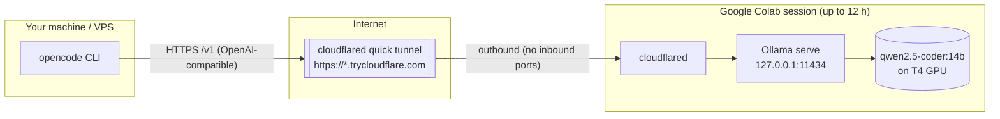

# Colab Ollama Tunnel

Run serious open-weight coding models on a free Google Colab GPU and use them from **opencode** (or
any OpenAI-compatible client) on your own machine — with zero GPU hardware of your own.

The notebook spins up [Ollama](https://ollama.com) inside a Colab session, auto-picks the best model
for the GPU you were granted, and exposes it through a temporary public HTTPS tunnel
([cloudflared](https://developers.cloudflare.com/cloudflare-one/connections/connect-networks/do-more-with-tunnels/trycloudflare/)).
Your local `opencode` then talks to `https://<host>.trycloudflare.com/v1` like any other API.

[](https://colab.research.google.com/github/Tabasiarash/colab-ollama-tunnel/blob/main/colab_ollama.ipynb)

## How it works



1. The notebook installs Ollama + cloudflared inside the Colab VM.
2. It opens a **quick tunnel** — cloudflared dials out, so Colab's firewall (no inbound ports) is never an issue.
3. Your local client sends `/v1/*` requests to the public tunnel URL; cloudflared forwards them to Ollama.
4. **Keep-alive cell** pings Ollama every 5 minutes so the idle timeout never fires.

## Quick start

1. Open the notebook in Colab:\
   [](https://colab.research.google.com/github/Tabasiarash/colab-ollama-tunnel/blob/main/colab_ollama.ipynb)
2. **Runtime > Change runtime type** → Hardware accelerator: **T4 GPU**.
3. **Runtime > Run all** — sit back while it pulls the model (~10–20 min first time).
4. When it finishes, copy the printed `BASE URL` and **model id**.
5. On your machine, point opencode at it:

```bash
# clone the helper scripts
git clone https://github.com/Tabasiarash/colab-ollama-tunnel.git && cd colab-ollama-tunnel

# patch ~/.config/opencode/opencode.jsonc (model id is optional)
python3 update_config.py https://<BASE>.trycloudflare.com qwen2.5-coder:14b
```

6. Restart opencode — you're running on a Colab GPU.

The notebook also prints a copy-paste-ready `opencode.jsonc` block if you prefer to edit the config by
hand. `opencode.jsonc.example` is the same template with a placeholder URL.

## Which model do you get?

The notebook picks the strongest model that fits the hardware Colab gave you:

| Tier | Hardware | Model | Size | Good for |
| --- | --- | --- | --- | --- |
| **Free default** | T4 GPU (14 GB+ VRAM) | `qwen2.5-coder:14b` | ~9 GB | Agentic coding with real context headroom; SWE-bench 27%, HumanEval+ 83.5% |
| Free fallback | no GPU / small VRAM | `qwen2.5-coder:7b` | ~5 GB | CPU-only, slower, smaller context |
| **Pro / PayGo** | L4, A100, V100, L40S (22 GB+ VRAM) | `qwen3-coder:30b-a3b-q4_K_M` | ~19 GB | Top open agentic coder; MoE, 256K context |
| Any | any | `MODEL_OVERRIDE` | – | Force any real [Ollama tag](https://ollama.com/search?c=tools) |

Useful overrides: `gemma4:12b` (newest, 256K ctx), `qwen3:8b`, `gemma4:31b` (needs 24 GB+),
`devstal` (agentic, but fills a 16 GB card), `qwen2.5-coder:32b` (needs 24 GB+).

> `qwen3-coder:30b-a3b-q4_K_M` is the smallest real `qwen3-coder` tag (there is no `qwen3-coder:8b`).
> At ~19 GB it fits a 24 GB card but **not** a free T4's 15 GB VRAM, which is why it's the Pro-tier pick.

## Security

- The tunnel is **public and unauthenticated** — anyone who gets the URL can call the API (and burn
  your Colab quota).
- Treat the URL like a password: don't commit it, don't paste it into public chat.
- The URL and session die together (session cap ~12 h on free tier), which limits exposure.
- For anything beyond a scratch environment, put a real auth layer in front (e.g. Cloudflare Access,
  a token proxy) before exposing a model to the internet.

## Troubleshooting

| Symptom | Fix |
| --- | --- |
| First visit shows a Cloudflare "503 / What are you trying to do?" page | Expected — that's the quick-tunnel interstitial. Use the API (`curl https://<BASE>/api/tags`) or opencode, not a browser. |
| Model pulls forever / session restarts | 14B+ pull takes a while; a long-running cell keeps the session alive. Prefer T4 runtime. |
| OOM / process killed | You pulled a model too big for the tier (e.g. `30b` on a T4). Drop a tier via `MODEL_OVERRIDE`. |
| No T4 granted | CPU fallback auto-picks `7b`, which is workable but slow. Re-run later for a GPU. |
| opencode errors after restart | Check `baseURL` has `/v1` (the scripts add it) and restart opencode after editing the config. |
| Tunnel URL changed / session died | That's inherent — re-run the notebook, copy the **new** BASE URL, re-run `update_config.py`. |

## FAQ

**What is this?** A free "GPU rental" for open-weight coding models: Colab runs Ollama, a tunnel exposes
it, your local agent consumes it.

**Why a tunnel instead of an SSH/ngrok port?** Colab VMs accept no inbound connections; cloudflared
dials out and gives you a stable HTTPS URL that works from anywhere, including firewalled VPSes.

**What about the free-tier limits?** Sessions last ~12 h and idle out; the keep-alive cell prevents
idle timeout while running. Disk (~78 GB) and RAM (~12 GB) are enough for every default here.

**Can I use it from a VPS with opencode?** Yes — that's the intended setup. Point `baseURL` at the
tunnel URL; no ports need opening on the VPS either.

## Project layout

```
├── colab_ollama.ipynb       # the notebook (grab-and-go)
├── gen_colab_nb.py          # builds the notebook from source strings
├── update_config.py         # patches ~/.config/opencode/opencode.jsonc with the tunnel
├── opencode.jsonc.example   # hand-editable config template
├── README.md
└── LICENSE                  # MIT
```

## License

[MIT](LICENSE) © 2026 ArasT