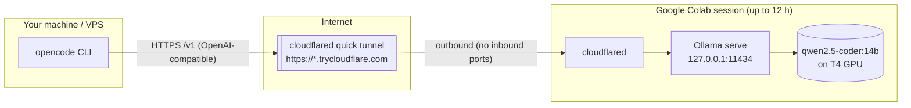

# Tokenless CLI

Run serious open-weight coding models on a free Google Colab GPU and use them from **opencode** or
**Gemini CLI** on your own machine — a truly **tokenless Gemini CLI**: zero API keys, zero token
costs, zero GPU hardware of your own.

The notebook spins up [Ollama](https://ollama.com) inside a Colab session, auto-picks the best model
for the GPU you were granted, and exposes it through a temporary public HTTPS tunnel
([cloudflared](https://developers.cloudflare.com/cloudflare-one/connections/connect-networks/do-more-with-tunnels/trycloudflare/)).
Your local `opencode` talks to `https://<host>.trycloudflare.com/v1` like any other API — and if you
prefer Google's agent, the wizard wires up the same tunnel as a **Tokenless Gemini CLI** through a
tiny local [LiteLLM](https://github.com/BerriAI/litellm) bridge.

[](https://colab.research.google.com/github/Tabasiarash/tokenless-cli/blob/main/colab_ollama.ipynb)

## How it works



1. The notebook installs Ollama + cloudflared inside the Colab VM.
2. It opens a **quick tunnel** — cloudflared dials out, so Colab's firewall (no inbound ports) is never an issue.
3. Your local client sends `/v1/*` requests to the public tunnel URL; cloudflared forwards them to Ollama.
4. **Keep-alive cell** pings Ollama every 5 minutes so the idle timeout never fires.

## Quick start

### Option A — install wizard (recommended)

After the notebook prints its `BASE URL`, run the wizard on your machine. It walks you through
everything step by step, checks the tunnel live, configures your CLI, and opens a browser chat:

```bash
git clone https://github.com/Tabasiarash/tokenless-cli.git && cd tokenless-cli

# macOS / Linux:
python3 wizard.py

# Windows:
wizard.bat
```

The wizard will:
1. Check prerequisites — and offer to auto-install **opencode** or **Gemini CLI** if missing.
2. Ask for the **BASE URL** from the notebook, then verify it can reach the tunnel.
3. Let you pick the **model** from the ones actually pulled on Colab.
4. Ask which **engine** you want:
   * **opencode** (direct, recommended) — patches `~/.config/opencode/opencode.jsonc`
     (a `.bak` is kept); restart opencode when it's done.
   * **Gemini CLI** — the *Tokenless Gemini CLI*: starts a local LiteLLM bridge on port 4000 that
     speaks Gemini's API and relays it to the tunnel, then launches `gemini --sandbox=false`.
   * **Both** — configure opencode and launch the Gemini bridge.
5. Send a one-shot **test message** through the tunnel, and
6. Open a **browser chat** (`web/chat.html`) so you can chat with the model right away —
   optionally also served over your LAN (`http://<your-ip>:8080/chat.html`) for your phone.

Re-running the wizard reuses your last setup.

### Option A2 — GUI installer (macOS & Windows)

Prefer a window over a terminal? Grab the matching installer from the
[latest release](https://github.com/Tabasiarash/tokenless-cli/releases):

* **macOS** — `tokenless-cli-<version>.dmg` (drag the *Tokenless CLI Wizard* app to Applications)
* **Windows** — `Tokenless-CLI-Setup-<version>.exe` (one-file wizard, no installation)

The GUI wizard exposes the same steps (tunnel check, model picker, engine choice, smoke test,
browser chat, Gemini bridge launch) — the `.app`/`.exe` are built automatically for every new tag by
[GitHub Actions](.github/workflows/build-release.yml).

The app is not notarized/signed:
* **macOS** — right-click the app (or the DMG copy) → *Open* the first time (Gatekeeper).
* **Windows** — click *More info* → *Run anyway* on the SmartScreen prompt.

Packaged only with `pyinstaller`; the wizard itself remains plain standard-library Python
(`python3 wizard_gui.py` works too).

### Option B — manual (`update_config.py`)

1. Open the notebook in Colab:\
[](https://colab.research.google.com/github/Tabasiarash/tokenless-cli/blob/main/colab_ollama.ipynb)
2. **Runtime > Change runtime type** → Hardware accelerator: **T4 GPU**.
3. **Runtime > Run all** — sit back while it pulls the model (~10–20 min first time).
4. When it finishes, copy the printed `BASE URL` and **model id**.
5. On your machine, point opencode at it:

```bash
# clone the helper scripts
git clone https://github.com/Tabasiarash/tokenless-cli.git && cd tokenless-cli

# patch ~/.config/opencode/opencode.jsonc (model id is optional)
python3 update_config.py https://<BASE>.trycloudflare.com qwen2.5-coder:14b
```

6. Restart opencode — you're running on a Colab GPU.

## Browser chat

`web/chat.html` is a zero-dependency chat UI that talks **directly** to the tunnel from your browser
(Ollama sends `Access-Control-Allow-Origin: *`, so no local server is needed). Open it manually and
paste the BASE URL, or let the wizard open it pre-configured:

```
file:///.../tokenless-cli/web/chat.html?base=https%3A%2F%2F<BASE>.trycloudflare.com&model=qwen2.5-coder:14b
```

## Use it with Gemini CLI (a Tokenless Gemini CLI)

Google's [Gemini CLI](https://github.com/google-gemini/gemini-cli) normally talks Google's own API.
The tunnel only serves OpenAI's `/v1`, so the wizard inserts one translation hop: a local
[LiteLLM](https://github.com/BerriAI/litellm) proxy on **port 4000** that exposes Gemini's
`/v1beta/models/...:generateContent` endpoints, maps Gemini CLI's internal model ids onto the Colab
model, and relays every call through the tunnel as plain OpenAI requests.

```
+----------------+            +---------------------+            +---------------+
| gemini CLI     |  locally   | LiteLLM proxy :4000 |  HTTPS /v1  | Colab tunnel  |
|                |------------> (Gemini translation)|-------------> + Ollama model |
| --sandbox=false| Gemini ./v1beta                    OpenAI ./v1  |
+----------------+            +---------------------+            +---------------+
```

The wizard does all of this for you when you pick the **Gemini CLI** engine:

```bash
python3 wizard.py
# engine: gemini          -> installs litellm, writes ~/.tokenless-cli/litellm_config.yaml,
#                            starts the bridge, launches gemini --sandbox=false
# engine: both            -> same, plus opencode's config is patched too
```

Notes:
- The bridge runs locally (`litellm --config ... --port 4000`); stop it with `Ctrl+C` in its window
  or `pkill -f "litellm --config"`.
- **`--sandbox=false` is required** — Gemini CLI does not forward `GOOGLE_GEMINI_BASE_URL` into its
  bundled sandbox container (google-gemini/gemini-cli#2168), so code actions run on your machine.
- LiteLLM needs Python (`python3 -m pip install litellm`) and is started automatically; the
  `model_group_alias` map covers the model ids Gemini CLI 0.47 requests. If a future gemini update
  requests a new id, add it to `~/.tokenless-cli/litellm_config.yaml` and restart the bridge.

The notebook also prints a copy-paste-ready `opencode.jsonc` block if you prefer to edit the config by
hand. `opencode.jsonc.example` is the same template with a placeholder URL.

## Which model do you get?

The notebook picks the strongest model that fits the hardware Colab gave you:

| Tier | Hardware | Model | Size | Good for |
| --- | --- | --- | --- | --- |
| **Free default** | T4 GPU (14 GB+ VRAM) | `qwen2.5-coder:14b` | ~9 GB | Agentic coding with real context headroom; SWE-bench 27%, HumanEval+ 83.5% |
| Free fallback | no GPU / small VRAM | `qwen2.5-coder:7b` | ~5 GB | CPU-only, slower, smaller context |
| **Pro / PayGo** | L4, A100, V100, L40S (22 GB+ VRAM) | `qwen3-coder:30b-a3b-q4_K_M` | ~19 GB | Top open agentic coder; MoE, 256K context |
| Any | any | `MODEL_OVERRIDE` | – | Force any real [Ollama tag](https://ollama.com/search?c=tools) |

Useful overrides: `gemma4:12b` (newest, 256K ctx), `qwen3:8b`, `gemma4:31b` (needs 24 GB+),
`devstal` (agentic, but fills a 16 GB card), `qwen2.5-coder:32b` (needs 24 GB+).

> `qwen3-coder:30b-a3b-q4_K_M` is the smallest real `qwen3-coder` tag (there is no `qwen3-coder:8b`).
> At ~19 GB it fits a 24 GB card but **not** a free T4's 15 GB VRAM, which is why it's the Pro-tier pick.

## Security

- The tunnel is **public and unauthenticated** — anyone who gets the URL can call the API (and burn
  your Colab quota).
- Treat the URL like a password: don't commit it, don't paste it into public chat.
- The URL and session die together (session cap ~12 h on free tier), which limits exposure.
- For anything beyond a scratch environment, put a real auth layer in front (e.g. Cloudflare Access,
  a token proxy) before exposing a model to the internet.

## Troubleshooting

| Symptom | Fix |
| --- | --- |
| First visit shows a Cloudflare "503 / What are you trying to do?" page | Expected — that's the quick-tunnel interstitial. Use the API (`curl https://<BASE>/api/tags`) or opencode, not a browser. |
| Model pulls forever / session restarts | 14B+ pull takes a while; a long-running cell keeps the session alive. Prefer T4 runtime. |
| OOM / process killed | You pulled a model too big for the tier (e.g. `30b` on a T4). Drop a tier via `MODEL_OVERRIDE`. |
| No T4 granted | CPU fallback auto-picks `7b`, which is workable but slow. Re-run later for a GPU. |
| opencode errors after restart | Check `baseURL` has `/v1` (the scripts add it) and restart opencode after editing the config. |
| Tunnel URL changed / session died | That's inherent — re-run the notebook, copy the **new** BASE URL, re-run `update_config.py`. |

## FAQ

**What is this?** A free "GPU rental" for open-weight coding models: Colab runs Ollama, a tunnel exposes
it, your local agent consumes it.

**Why a tunnel instead of an SSH/ngrok port?** Colab VMs accept no inbound connections; cloudflared
dials out and gives you a stable HTTPS URL that works from anywhere, including firewalled VPSes.

**What about the free-tier limits?** Sessions last ~12 h and idle out; the keep-alive cell prevents
idle timeout while running. Disk (~78 GB) and RAM (~12 GB) are enough for every default here.

**Can I use it from a VPS with opencode?** Yes — that's the intended setup. Point `baseURL` at the
tunnel URL; no ports need opening on the VPS either.

**Can I use the tunnel with Google's Gemini CLI?** Yes — the wizard's **Gemini CLI** engine starts a
local LiteLLM bridge that translates Gemini's API into the tunnel's OpenAI format (see
["Use it with Gemini CLI"](#use-it-with-gemini-cli-a-tokenless-gemini-cli)). It runs with
`--sandbox=false` because Gemini CLI doesn't forward custom base URLs into its sandbox.

## Project layout

```
├── colab_ollama.ipynb       # the notebook (grab-and-go)
├── gen_colab_nb.py          # builds the notebook from source strings
├── wizard.py                # interactive installer (macOS / Windows)
├── wizard.sh / wizard.bat   # one-line launcher for the wizard
├── gemini_bridge.py         # "Tokenless Gemini CLI": builds the LiteLLM config,
│                            #   starts the bridge, launches gemini --sandbox=false
├── litellm_config.example.yaml  # hand-editable LiteLLM bridge config template
├── web/chat.html            # zero-dependency browser chat UI
├── update_config.py         # patches ~/.config/opencode/opencode.jsonc with the tunnel
├── opencode.jsonc.example   # hand-editable config template
├── tests/                   # mock-Ollama E2E tests (python3 tests/test_all.py)
├── README.md
└── LICENSE                  # MIT
```

## License

[MIT](LICENSE) © 2026 ArasT